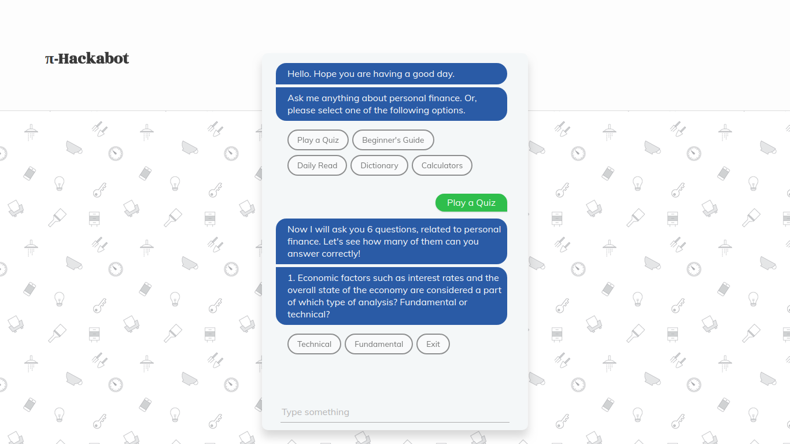

# π-Hackabot

For the Moneycontrol Budget Hackabot Challenge, we developed a web based chat-bot to address
the second problem statement which is the 'Gamification for Personal Finance'. There are two parts of the problem and in this README we also highlight the approaches we used to solve them. You can view the web-based bot: [https://pihackabot.mybluemix.net](https://pihackabot.mybluemix.net).



## 1. Features (Part I of Problem II)

* Quiz - to put the financial knowledge of the user to test.
* FAQs - for users to obtain knowledge of basic as well as advanced concepts.
* Daily Read Subscription - Recommends a Moneycontrol.com article everyday to the user.
* Calculators - built in with various calculators (such as EMI, Crorepati Calculator, Asset Allocator, Gratuity Calculator, etc)

## 2. Predictor (Part II of Problem II)

The predictor is built on a Linear Regression model. The features we are taking into
consideration are the stock's 1. Opening Price 2. Day's High, and 3. Day's Low to predict the closing price, which in turn serves as a measure to consider buying or selling the asset. The Jupyter Notebook can be found in `./predictor` containing `main.ipynb` and the `TSLA.csv` which we used to train the model.

## Tech Stack

* Served via IBM Bluemix
* Built using IBM Watson Conversation Service
* Data/Resource via Moneycontrol.com & Investopedia.com
* TSLA 6 mo dataset via Yahoo! Finance

## Local Installation

1. Clone the repository to run the package into the local Node.js runtime environment:

   ```bash
   npm install
   ```

2. Start the app:

   ```bash
   npm start
   ```

3. Point your browser to http://localhost:3000 to try out the app.

## Team

Built by Yash Mahalwal and Abhishek Warokar
